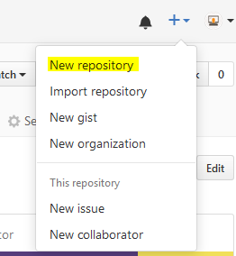
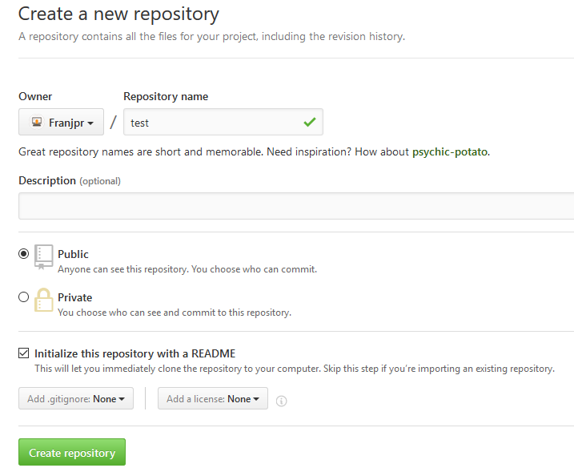
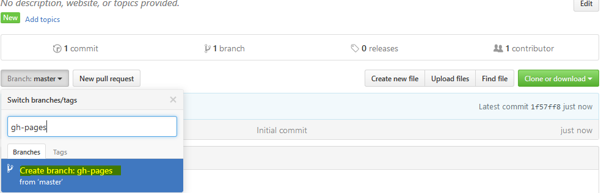

GitHub-Pages
==

GitHub ofrece un servicio de alojamiento web para repositorios, la única condicion que deben tener
para ello es crear una rama **gh-pages** y tener el index.html a mostrar.

Pasos:
* Crear un repositorio con un readme en github.

  

  

*  Creamos una rama GitHub-Pages

  

* Añadimos un fichero y lo llamamos index.html

  

  

* Hacemos el commit

    

* Y listo! Para acceder a la gh-pages de nuestro repo usamos la siguiente url '**username**.github.io/**repo-name**'

  **https://franjpr.github.io/test/**

## GitHub-Page Personal

Para crear una gh-page personal, no hace falta hacer una rama gh-pages, se hace todo en la rama master, la única diferencia es que el repositorio debe tener como nombre nuestro nombre de usuario, y accedemos a ella mediante la url con formato **username**.github.io , por ejemplo: '  **https://franjpr.github.io**'
