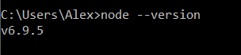
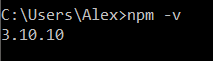
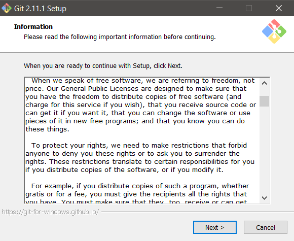
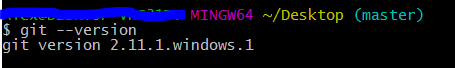
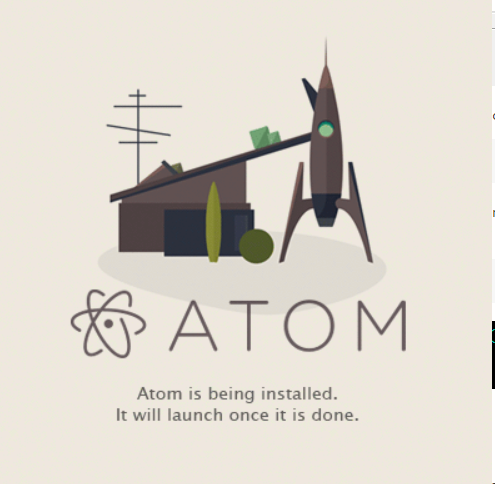

Instalación de aplicaciones
==

A continuacion veremos una sencilla guia de como instalar las siguientes aplic

##NodeJS

**NodeJS** es un entorno de ejecución para JavaScript construido con el motor de JavaScript V8 de Chrome. Node.js usa un modelo de operaciones E/S sin bloqueo y orientado a eventos, que lo hace liviano y eficiente.

El cual se puede descargar desde el siguiente enlace [nodejs.org](https://nodejs.org/es/download/).

###Instalacion

Para instalar NodeJS descargamos el instalador de la pagina oficial para nuestro sistema operativo desde el enlace anterior y procedemos a ejecutarlo.

Seguimos los pasos indicados en el instalador los cuales nos permitiran ejecutar los comandos "npm" y "node" en la terminal.

Para verificar la instalacion de NodeJS, abrimos una terminal y ejecutamos el comando:<pre>node --version</pre>

Y el comando: <pre>npm -v</pre>

Al obtener la salida de los dos comandos con las versiones de node y npm respectivamente podemos confirmar la instalacion de los dos comandos.

##Git/Git for Windows

**Git** es un software de control de versiones, pensando en la eficiencia y la confiabilidad del mantenimiento de versiones de aplicaciones cuando éstas tienen un gran número de archivos de código fuente.

Para instalar git para Windows en [Git-for-Windows](https://git-scm.com/download/win) y para Mac en [Git-for-Mac](https://git-scm.com/download/mac).

###Instalación

Para las instalaciones en Windows y en Mac procedemos a seguir la instrucciones y seleccionar preferencias con las que deseamos instalar Git.

Para instalar instalar en un sistema Debian/Ubuntu lo podremos hacer con el siguiente comando: 
<pre>sudo apt-get install git </pre> En caso de tener otra distribución de Linux visita este enlace para poder instalar [Git](https://git-scm.com/download/linux).

Para comprobar la instalación ejectamos en la terminal el comando: <pre> git --version </pre> 

##Atom 

**Atom** es un editor de codigo de software libre desarrollado por el personal de GitHub.

La instalacion de este editor de texto es muy sencilla, basta con descargarlo en el siguiente enlace [atom.io](https://atom.io/) y ejectar el archivo y tras su ejecucion ya estamos listos para poder utilizar **Atom**.

##GitBook

**GitBook** es una excelente herramienta para crear documentación de proyectos y libros técnicos usando Markdown y Git/Github. GitBook tiene una version de escritorio la cual nos permite editar nuestros libros desde nuestra propia maquina y realizar un push de los cambios a nuestra cuenta de repositorio ya sea de **GitHub o **GitBook**

