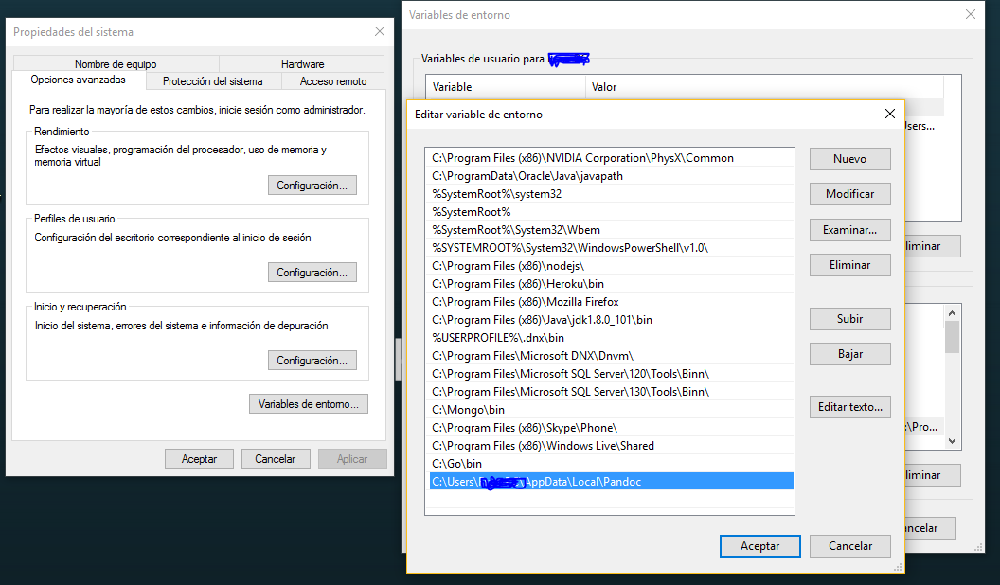
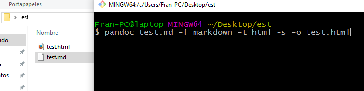
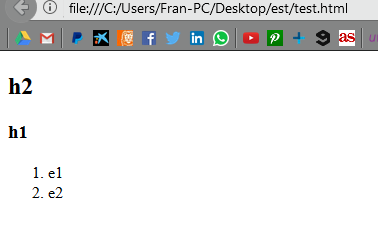

Documentación Pandoc
==
Pandoc es una herramienta de linea de comandos. No hay interfaz gráfica, por lo que tenemos que usar la terminal,

Para descargarlo vamos a [pandoc.org](https://github.com/jgm/pandoc/releases/tag/1.19.2.1) y lo instalamos.

#### Cómo usarlo.

Primero verificamos que se instaló con el comando `pandoc -v` en la terminal, y deberíamos tener una salida como esta:

Si no nos reconoce el comando, debemos añadirlo a nuestro PATH de variables de entorno.

El pandoc lo usaremos para convertir un fichero en markdown a html y viceversa.
Nos creamos un fichero test.md
~~~
## h2
### h1

1. e1
2. e2
~~~

Y ejecutamos el comando `pandoc test.md -f markdown -t html -s -o test.html` , donde **-f** representa *from* y **-t** *to*,
si queremos traducir de html a markdown solo tenemos que intercambiar dichos formatos.

Resultado:

